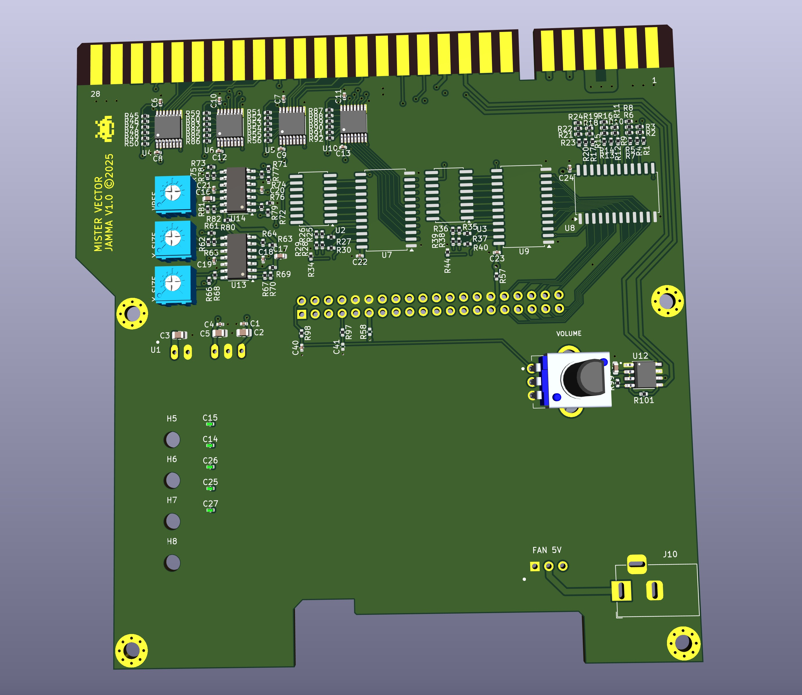

## MisterArcade
## DE10-Nano adapter board for vector graphics output

* 3.5mm line level audio jack output - no onboard amplifier
* No slow or overclocked serial DACs. Latched, high speed, low cost R–2R ladder to perform digital-to-analog conversion
* Uses DE10-Nano GPIO1 2x20 connector for input from FPGA (GPIO2 remains free for standard MisterArcade RAM expansion)
* No digital inputs or outputs
* No JAMMA connection
* Standard KK-254 header connection for vector outputs
* Standard DB15 VGA connector for video outputs

* 10bit +/- 10v X output
* 10bit +/- 10v Y output
* 6bit 0-3.3v RED output
* 6bit 0-3.3v GREEN output
* 6bit 0-3.3v BLUE output

